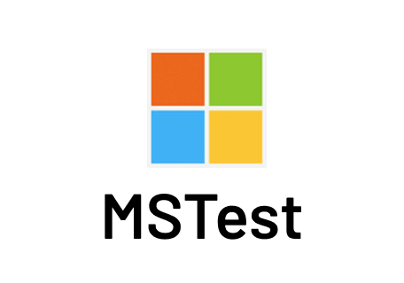

# MSTest-browserstack
Sample code for running sessions with MSTest on BrowserStack using Selenium 3.   

> To perform tests using Selenium 4, please checkout the main branch

> To perform tests using SDK, please checkout the sdk branch

[MSTest](https://docs.microsoft.com/en-us/dotnet/core/testing/unit-testing-with-mstest) Integration with BrowserStack.

## Setup

### Installation Steps

1. Clone the repository.
2. Open the solution `MSTest-BrowserStack.sln` in Visual Studio.
3. Install dependencies using NuGet Package Manager:
   
    ```bash
    dotnet restore
    ```
4. Build the solution

### Adding Credentials

1. Add your BrowserStack Username and Access Key to the `secrets.json` file in the project. You can follow [this guide](https://learn.microsoft.com/en-us/aspnet/core/security/app-secrets?view=aspnetcore-8.0&tabs=windows#read-the-secret-via-the-configuration-api) to learn how to manage secrets.
   
    ```json
    {
      "BrowserStackUsername": "your-browserstack-username",
      "BrowserStackAccessKey": "your-browserstack-access-key"
    }
    ```

2. Alternatively, you can set environment variables:
    - `BROWSERSTACK_USERNAME`
    - `BROWSERSTACK_ACCESS_KEY`

You can get your BrowserStack credentials from [here](https://www.browserstack.com/accounts/profile/details)

### Running Tests

- To run tests, execute the following command:
    ```bash
    dotnet test
    ```

- To run the single test, execute the following command:
    ```bash
    dotnet test --filter ClassName=MSTest_browserstack.SingleTest
    ```

- To run tests in parallel, execute the following command:
    ```bash
    dotnet test --filter ClassName=MSTest_browserstack.ParallelTest
    ```

- To run local tests, execute the following command:
    ```bash
    dotnet test --filter ClassName=MSTest_browserstack.LocalTest
    ```

Understand how many parallel sessions you need by using our [Parallel Test Calculator](https://www.browserstack.com/automate/parallel-calculator?ref=github)

### Notes

* View your test results on the [BrowserStack automate dashboard](https://www.browserstack.com/automate).
* For testing on different browsers, check the [platform configurator](https://www.browserstack.com/automate/c-sharp#setting-os-and-browser).
* Export the environment variables for BrowserStack credentials:

    ```bash
    export BROWSERSTACK_USERNAME=<browserstack-username> &&
    export BROWSERSTACK_ACCESS_KEY=<browserstack-access-key>
    ```

## Additional Resources

* [Documentation for writing automate test scripts in C#](https://www.browserstack.com/automate/c-sharp).
* [Customizing your tests on BrowserStack](https://www.browserstack.com/automate/capabilities).
* [Browsers & mobile devices for selenium testing on BrowserStack](https://www.browserstack.com/list-of-browsers-and-platforms?product=automate).
* [Using REST API to access information about your tests via the command-line interface](https://www.browserstack.com/automate/rest-api).
